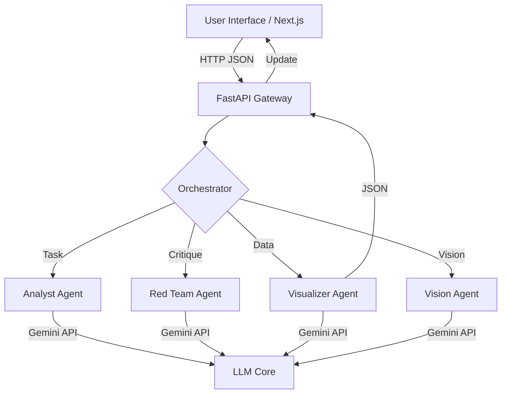

<div align="center">

# 🌐 NEXUS-3 GENESIS
### GLOBAL CRISIS ORCHESTRATION ENGINE

[](https://opensource.org/licenses/MIT)
[](https://nextjs.org/)
[](https://fastapi.tiangolo.com/)
[](https://tailwindcss.com/)
[](https://deepmind.google/technologies/gemini/)

<br />

> *"Intelligence is not about knowing everything. It's about questioning everything."*

</div>

---

## 📡 SYSTEM OVERVIEW

**Nexus-3** is a high-fidelity decision support system designed for global situational awareness. It integrates advanced Large Language Model reasoning with real-time data visualization to orchestrate responses to complex geopolitical, environmental, and public health crises.

Powered by **Gemini 3 Pro**, the engine employs a Multi-Agent architecture to deconstruct scenarios, challenge assumptions (Red Teaming), and visualize projected impacts.

---

## ⚡ CORE CAPABILITIES

### 🧠 Deep Reasoning Core
Leverages **Chain-of-Thought (CoT)** reasoning to simulate second-order and third-order effects of global events. The backend orchestration service coordinates multiple specialized AI agents to ensure comprehensive analysis.

### 🕵️ Multi-Agent Swarm
- **The Analyst**: Deconstructs scenarios using System 2 logic.
- **The Red Team**: Adversarial agent that identifies blind spots and worst-case outcomes.
- **The Visualizer**: Transforms unstructured cognitive data into structured visualization metrics.
- **The Visionary**: Multimodal agent capable of interpreting charts, maps, and satellite imagery via **Visual Command**.

### 👁️ Visual Command
Upload charts, reconnaissance maps, or data snapshots directly into the dashboard. Nexus-3 uses multimodal vision capabilities to extract data points, generate logic trees, and integrate findings into the simulation model.

---

## 🛠️ ARCHITECTURE



---

## 🚀 DEPLOYMENT PROTOCOLS

### Prerequisites
- Node.js v18+
- Python 3.10+
- Google Gemini API Key

### 1. Initialize Frontend (Command Center)
```bash
npm run dev
# Access via localhost:3000
```

### 2. Activate Backend (Deep Reasoning Node)
```bash
cd backend
pip install -r requirements.txt
uvicorn main:app --reload
# Access API via localhost:8000
```

---

## 📦 COMPONENT STACK

| Component | Technology | Purpose |
|-----------|------------|---------|
| **Frontend** | Next.js 14, React | Immersive UI/UX |
| **Styling** | Tailwind CSS v4 | Glassmorphism & Theming |
| **Backend** | FastAPI, Pydantic | Agent Orchestration |
| **AI Model** | Gemini 1.5 Pro (Latest) | Cognitive Engine |
| **Search** | DuckDuckGo API | Live Context Retrieval |
| **Reporting** | ReportLab | PDF Intelligence Briefs |

---

